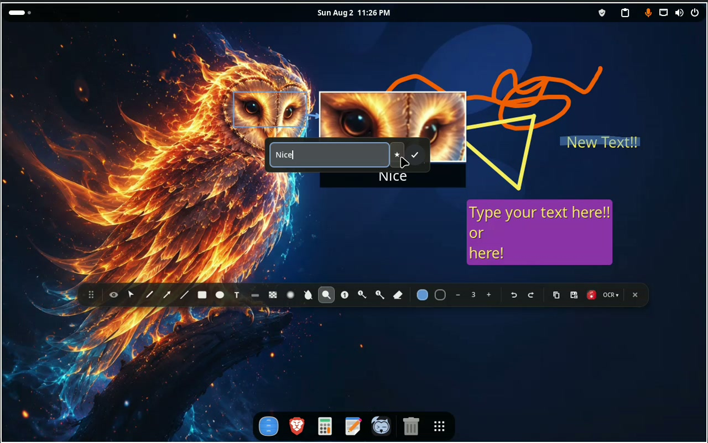

<div align="center">

# Big Shot

**Enhanced screenshots and screencasts for GNOME Shell**

Big Shot extends GNOME's native `Print Screen` interface with screenshot
annotation, OCR, audio recording, webcam overlays, live video annotation, and
hardware-accelerated encoding.


[](https://www.gnome.org/) [](https://gjs.guide/) [](LICENSE) [](https://gstreamer.freedesktop.org/) [](usr/share/gnome-shell/extensions/big-shot@communitybig.org/po/)

</div>

## Demo

[](docs/media/big-shot-demo.mp4)

Click the image to watch the full H.264/MP4 demo.

## Highlights

- 16 screenshot annotation tools in a draggable toolbar
- OCR with automatic language detection and clipboard output
- Full-screen, area, and window screencasts
- Desktop audio and microphone capture, independently or mixed
- 15, 24, 30, or 60 FPS and 100%, 75%, 50%, or 33% resolution
- Automatic NVIDIA, AMD, and Intel hardware-encoder detection
- H.264, H.265/HEVC, and VP9 codec choices with GNOME fallback
- Draggable webcam preview with camera selection, 8 masks, and 5 sizes
- Live and paused video annotation captured directly in the recording
- Segment-based pause/resume with lossless `ffmpeg` concatenation
- Screenshots and annotated screenshots while a screencast is active

Everything is integrated into GNOME Shell's native screenshot UI; no separate
editor window is required.

## Screenshot annotation

### Tools

| Tool | Behavior |
|---|---|
| Select / Move | Select and drag an existing annotation; resize selected text |
| Pen | Smoothed freehand stroke |
| Arrow | Arrow with a proportional head and shadow; `Shift` snaps its axis |
| Line | Straight line; `Shift` snaps horizontally or vertically |
| Rectangle | Outlined or filled rectangle; `Shift` creates a square |
| Oval | Outlined or filled ellipse; `Shift` creates a circle |
| Text | Multiline text with any installed Pango font |
| Highlighter | Semi-transparent marker; `Shift` keeps the stroke horizontal |
| Censor | Mosaic pixelation using the captured image's real pixels |
| Blur | Three-pass box blur using the captured image's real pixels |
| Invert Colors | Inverts the selected image region |
| Magnify / Zoom | Creates a movable magnified callout with an optional caption |
| Number | Sequential numbered badge |
| Number with Arrow | Sequential badge connected to an arrow |
| Number with Pointer | Sequential badge connected to a dot pointer |
| Eraser | Removes the annotation under the pointer |

### Editing controls

- 12-color stroke palette and 5 semi-transparent highlighter colors
- Independent fill color for rectangles and ovals
- Brush size from 1 to 100, with buttons, scroll, and 1–14 presets
- Five intensity levels for Censor and Blur
- Font family picker for text
- Undo and redo history
- Movable annotations, text resizing, and editable zoom captions
- Zoom-callout magnification adjustable by scrolling the selected callout
- Copy composited PNG directly to the clipboard
- Save As via the desktop portal file chooser
- Toggle the native bottom panel while editing
- Hover tooltips and toolbar opacity feedback

### OCR and selection magnifier

OCR runs Tesseract on the composited screenshot and copies extracted text to
the clipboard. Big Shot discovers installed language data, chooses a language
from the current locale, and offers a language selector. If Tesseract or its
language data is missing, install it with the distribution's package manager.

While selecting a screenshot area, hold `Shift` to show the 300 px circular
magnifier. Scroll while it is visible to change magnification from 2× to 6×.

## Screencast recording

Big Shot keeps GNOME's full-screen and area recording flows and adds window
recording by passing the selected window rectangle to the screencast service.
Recordings are stored under `~/Videos/BigShot/` with localized filenames.

| Setting | Choices |
|---|---|
| Framerate | 15, 24, 30 (default), or 60 FPS |
| Resolution | 100% (default), 75%, 50%, or 33% |
| Quality | High (default), Medium, or Low |
| Codec | Auto or any compatible detected pipeline |
| Audio | Desktop, microphone, both mixed, or neither |
| Camera | Auto or a detected V4L2 camera |
| Webcam mask | None, Circle, Oval, Soft, Spot, Ornate, Checker, or Neon |
| Webcam size | XS (120 px), S (200 px), M (320 px), L (480 px), or XL (640 px) |

The floating Video Settings panel exposes quality and codec controls. Camera,
mask, and size rows appear when the webcam is enabled; microphone selection
appears when multiple inputs are available.

### Audio

Audio devices are discovered through `Gvc.MixerControl`, which works with
PulseAudio and PipeWire's PulseAudio compatibility layer. Desktop monitor and
microphone channel counts are detected at runtime. When both inputs are active,
GStreamer combines them with `audiomixer` and latency compensation.

MP4 pipelines choose the first available AAC encoder (`fdkaacenc`,
`avenc_aac`, or `voaacenc`); WebM uses Vorbis. If the selected container has no
compatible audio encoder, recording continues without audio.

### Webcam overlay

Big Shot probes `/dev/video0` through `/dev/video9`, removes duplicate device
names, and falls back to `pipewiresrc` if needed. The preview preserves the
camera's aspect ratio, mirrors it horizontally, and remains draggable when it
moves from the screenshot UI to GNOME TopChrome for recording.

All masks are generated from the webcam's RGBA pixels:

| Mask | Effect |
|---|---|
| None | Unmasked camera frame |
| Circle | Circular crop with a soft edge |
| Oval | Elliptical crop using the full frame |
| Soft | Strong feathering around a circular frame |
| Spot | Circular spotlight/vignette |
| Ornate | BigCommunity blue-purple-pink gradient border |
| Checker | Radial checkerboard border |
| Neon | Magenta neon ring and glow |

### Live annotation and pause/resume

During recording, the top panel gains edit, clear, and pause/resume controls:

1. Use the pencil button to enter live edit mode. Annotations are rendered in
   TopChrome and captured by the screencast.
2. Use the clear button to remove all active video annotations.
3. Pause to finalize the current segment and automatically enter paused edit
   mode. Exiting edit mode does not resume recording.
4. Resume to close paused edit mode and start the next segment with the same
   video, audio, and webcam settings.
5. On final stop, multiple segments are concatenated with `ffmpeg -c copy` and
   temporary files under `~/Videos/BigShot/.segments/` are removed. When
   `ffmpeg` is unavailable, Big Shot keeps recording but omits pause/resume.

Censor, Blur, and Invert capture the current stage for an accurate pixel-based
preview in both live and paused modes. The recording toolbar and panel controls
are excluded from those preview captures.

Opening the UI directly in screencast mode stops an active recording quickly.
Opening it in screenshot mode keeps the recording active, allowing screenshots
and annotation during the screencast.

## Encoder detection

At startup Big Shot lazily detects GPU vendors with `lspci` and checks required
GStreamer elements with `gst-inspect-1.0`. Auto mode tries compatible hardware
pipelines first and then the lightweight software H.264 fallback. If every
custom pipeline fails, recording falls back to GNOME's default pipeline.

| Hardware | Detected pipelines | Container |
|---|---|---|
| NVIDIA | NVENC H.264, NVENC H.265 | MP4 |
| AMD / Intel | VA H.264 Low-Power, VA H.264, VA H.265 Low-Power, VA H.265 | MP4 |
| AMD / Intel legacy | VAAPI H.264, VAAPI H.265 | MP4 |
| Software | OpenH264 | MP4 |
| Software, manual | x264 H.264, x265 H.265 | MP4 |
| Software, manual | VP9 | WebM |

The GNOME screencast service supplies `pipewiresrc`, its framerate caps, and
the output sink. Big Shot injects the conversion, scaling, encoder, audio, and
muxer portions of the pipeline. Downscaled dimensions are rounded to even
values for encoder compatibility.

## Keyboard and pointer shortcuts

| Shortcut | Action |
|---|---|
| `1`–`9` | Pen, Arrow, Line, Rectangle, Oval, Text, Highlighter, Censor, Number |
| `B` | Blur |
| `I` | Invert Colors |
| `E` | Eraser |
| `0` or `S` | Select / Move mode |
| `Ctrl+Z` | Undo |
| `Ctrl+Shift+Z` or `Ctrl+Y` | Redo |
| `Delete` or `Backspace` | Remove the selected or most recent annotation |
| `Escape` | Deselect, or exit video edit mode |
| `Ctrl+Scroll` | Change brush size, or Censor/Blur intensity |
| Scroll selected text | Change font size |
| Scroll selected zoom callout | Change callout magnification |
| Hold `Shift` during area selection | Show the selection magnifier |

## Compatibility

- GNOME Shell 46, 47, 48, 49, and 50
- Arch Linux and Arch-based distributions
- PulseAudio or PipeWire with PulseAudio compatibility
- GStreamer 1.0
- V4L2 or PipeWire webcam capture

The package includes a guarded workaround for the GNOME 49
`Gst.init_check(null)` screencast-service failure. The installation hook probes
for the exact failure before patching the service, keeps a backup, reapplies the
fix after GNOME Shell upgrades, and restores the original file on removal.

## Installation

### Arch Linux package

From a cloned repository:

```bash
cd pkgbuild
makepkg -si
```

The package builds gettext catalogs, installs the extension system-wide, runs
focused checks, and enables the GNOME 49 workaround only when the system needs
it.

#### UUID migration

Releases using `big-shot@bigcommunity.org` are a separate GNOME extension.
After upgrading the system package, log out and back in, then enable
`big-shot@communitybig.org`. If the legacy UUID was also installed per-user,
remove that user copy first:

```bash
gnome-extensions disable big-shot@bigcommunity.org
gnome-extensions uninstall big-shot@bigcommunity.org
gnome-extensions enable big-shot@communitybig.org
```

The package removes legacy system files but never edits a user's GNOME
extension settings as root.

### GNOME extension bundle

Install `gnome-extensions` and `gettext`, then run:

```bash
./scripts/build-gnome-extension.sh
gnome-extensions install --force \
  dist/big-shot@communitybig.org.shell-extension.zip
gnome-extensions enable big-shot@communitybig.org
```

Log out and back in so GNOME Shell loads the extension. The build script stages
the source in a temporary directory, compiles translations, and writes the
upload-ready archive to `dist/` without modifying extension sources.

The first EGO bundle declares GNOME Shell 50 only, matching the release tested
end to end. The source metadata used by the distribution package retains its
broader compatibility list and package-specific GNOME 49 workaround.

## Dependencies

### Runtime

| Arch package | Purpose |
|---|---|
| `gnome-shell >= 46` | Extension host and native screenshot UI |
| `gstreamer` | Pipeline framework and `gst-inspect-1.0` |
| `gst-plugins-base` | Conversion, scaling, app sink, mixing, and base elements |
| `gst-plugins-good` | PulseAudio, VP9, Vorbis, MP4, and WebM elements |
| `gst-plugins-bad` | OpenH264, VA-related, and additional codec elements |
| `gst-plugin-va` | Modern VA H.264/H.265 hardware encoders |
| `pciutils` | GPU detection with `lspci` |
| `ffmpeg` | Pause/resume segment concatenation |

### Optional

| Arch package | Purpose |
|---|---|
| `gst-plugins-ugly` | x264 and other additional codecs |
| `gst-libav` | AAC encoder fallback for MP4 audio |
| `tesseract` | OCR engine |
| `tesseract-data-*` | OCR language data |

### Build and development

| Package | Purpose |
|---|---|
| `gettext` | Compile `.po` catalogs to runtime `.mo` files |
| `nodejs` and `npm` | ESLint and Node test runner |
| `gnome-extensions` | Build and install the extension bundle |

## Development

```bash
npm install
npm run check
```

`npm run check` runs ESLint and the Node test suite. The tests cover dimension
scaling, overlay geometry, recording extension handling, pipeline integration
contracts, window recording, and the guarded GNOME screencast patch. The
PKGBUILD additionally syntax-checks every JavaScript file and the patch script.

After changing user-visible text, regenerate the gettext template and merge
all catalogs with `./scripts/update-translations.sh`. Use
`./scripts/update-translations.sh --check` to detect stale catalogs without
changing files.

Main source layout:

```text
usr/share/gnome-shell/extensions/big-shot@communitybig.org/
├── extension.js           Extension lifecycle, screenshots, OCR, recording
├── drawing/               Annotation actions, colors, and drawing overlay
├── parts/                 Toolbar, audio, webcam, indicators, and UI modules
├── lib/core.js            Pure geometry and path helpers
├── data/icons/            Symbolic toolbar icons
├── po/                    Gettext source catalogs
└── locale/                Compiled runtime catalogs
```

Use `./scripts/build-gnome-extension.sh` to create a clean bundle for
extensions.gnome.org. `scripts/vm-setup.sh` is available for a disposable GNOME
development VM.

## Translations

Big Shot ships gettext catalogs for 29 languages:

| | | | | |
|:---:|:---:|:---:|:---:|:---:|
| Bulgarian | Czech | Danish | German | Greek |
| English | Spanish | Estonian | Finnish | French |
| Hebrew | Croatian | Hungarian | Icelandic | Italian |
| Japanese | Korean | Dutch | Norwegian | Polish |
| Portuguese | Brazilian Portuguese | Romanian | Russian | Slovak |
| Swedish | Turkish | Ukrainian | Chinese | |

To add a language, copy
`usr/share/gnome-shell/extensions/big-shot@communitybig.org/po/big-shot.pot`
to a new `.po` file in the same directory, translate it, and rebuild the
extension bundle.

## Acknowledgments

Big Shot contains modified portions derived from
[GNOME Shell Screencast Extra Feature](https://github.com/WSID/gnome-shell-screencast-extra-feature)
by Wissle/WSID, licensed under GPL-2.0-or-later. Its screencast integration is
the foundation of the original audio, adjustment, indicator, quick-stop, and
pipeline work. See [NOTICE](NOTICE) for the distributed attribution.

## License

[GPL-2.0-or-later](LICENSE) — Copyright © 2024–2026 BigCommunity contributors.
The historical MIT notice for independently authored portions is retained in
[LICENSE.MIT](LICENSE.MIT).
